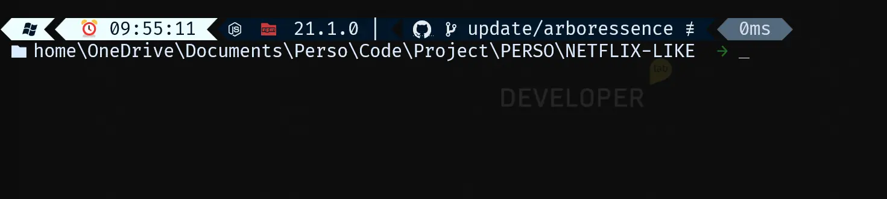

# 🎨 Theme Minimalist OhMyPosh

## ✨ Description

Ce projet propose un thème **minimaliste** et **personnalisé** pour OhMyPosh. 🖌️  
L'objectif est de fournir une expérience de terminal **épurée**, **intuitive** et **optimisée** pour les développeurs. Ce thème est compatible avec :

- 🪟 **Windows**
- 🍎 **macOS**
- 🐧 **Linux**

---

## 🚀 Fonctionnalités principales

- Affiche des informations système avec des icônes modernes.
- Supporte des outils comme **Node.js**, **Git**, et plus.
- Indique le temps d'exécution des commandes.
- Détecte les modifications dans vos dépôts Git.

---

## 📦 Installation rapide

1. Installez OhMyPosh (détails dans [INSTRUCTION_fr.md](./INSTRUCTION_fr.md)).
2. Importez le fichier de thème dans `C:/User/Username/.fichier_ici.json`.
3. Appliquez le thème à votre terminal.

---

## 📸 Aperçu visuel

> Voici à quoi ressemble le thème une fois appliqué :  
> (__)

---

## 📜 Licence

Ce projet est sous licence [MIT](./LICENSE). Vous êtes libre de l'utiliser, de le modifier et de le distribuer.

**⭐️ N'oubliez pas de donner une étoile à ce projet sur GitHub si vous l'appréciez !**
